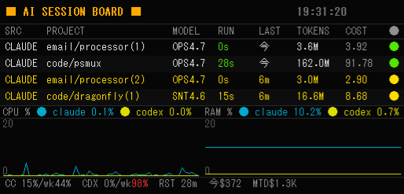

# AI Session Board

Real-time dashboard for **Claude Code** and **Codex CLI** sessions on Windows.



Two render targets in one binary:
- **Floating Win32 overlay** — always-on-top, draggable, never steals keyboard focus
- **In-terminal TUI** — pin it to a tmux/psmux pane

Shows per-project session activity, accurate task-run duration, OAuth quota usage, month-to-date cost, and live CPU/RAM charts for `claude*` and `codex*` processes.

## At-a-glance status

| Indicator | Meaning |
|---|---|
| Green ● + green RUN | Agent is currently streaming tokens |
| **Yellow ● + flashing row** | Agent has stopped — **waiting for user input** |
| Grey ○ + dim row | Idle (no activity in last 15 min) |

Sessions for the same project show as separate rows labeled `(1)`, `(2)` etc., so you can tell concurrent conversations apart at a glance.

## Install

```bash
cargo install ai-session-board
```

Or clone and build:

```bash
git clone https://github.com/warmbed/ai-session-board
cd ai-session-board
cargo build --release
# Binary: target/release/ai-board.exe
```

## Usage

```bash
ai-board              # Floating Win32 overlay
ai-board --tui        # ratatui TUI in current terminal
ai-board -t           # short for --tui
ai-board -h           # help
```

### TUI controls

| Key | Action |
|---|---|
| `q` / `Esc` / `Ctrl+C` | quit |
| `a` | toggle 24H / Active Only filter |
| `c` | toggle CPU/RAM charts |
| `r` | force refresh |

### Floating window

- Drag anywhere on the window to move
- Right-click for the context menu:
  - **24H / Active Only** — show today's full history vs only sessions active in the last 15 min
  - **Charts ON / OFF** — toggle CPU/RAM chart panel
  - **Opacity** — 40% / 70% / 100%
  - **Brightness** — 80% / 100% / 130% / 160% (multiplies all text colors)
  - **Size** — 50% / 75% / 100% / 150% / 200% (DPI-style scale)
  - **Close**

The window has `WS_EX_NOACTIVATE` so clicking on it never steals keyboard focus from your active terminal.

## Data sources

The board does **not** require any running server. It reads:

| Source | Purpose |
|---|---|
| `tu session -j --since YYYYMMDD` (subprocess) | session list, tokens, cost, models |
| `~/.claude/projects/**/*.jsonl` | last user-message timestamp + file mtime → accurate RUN duration |
| `~/.codex/sessions/YYYY/MM/DD/rollout-*.jsonl` (via `tu`) | Codex sessions |
| `%LOCALAPPDATA%\tokenusage\live-frame-cache.json` | quota footer (CC/CDX %) |
| `sysinfo` crate | CPU/RAM for processes whose name contains `claude` / `codex` |

### Why JSONL mtime?

`tu session` records when each message was *received*, but a Claude task can stream tokens for minutes after the response begins. The file's mtime keeps advancing as bytes are written, so:

```
RUN = file_mtime - timestamp_of_last_real_user_message
```

gives the actual cook duration ("Cooked for 10m 26s" semantics), not just the gap between user-prompt and first response chunk.

`type:"user"` JSONL entries that are tool results are filtered out — only real user typing resets `run_start`.

## Requirements

- Windows 10 / 11 (Win32 floating overlay is Windows-only; TUI works anywhere a terminal does)
- [`tu`](https://github.com/...) CLI in `PATH` for session data and quota
- Rust 1.74+ to build from source

## Architecture

```
src/
├── main.rs     # CLI dispatch (--tui flag)
├── lib.rs      # public API: run_floating(), run_tui()
├── widget.rs   # Win32 GDI floating overlay
└── tui.rs      # ratatui TUI + sysinfo sampler thread
```

Session data fetching is duplicated between widget.rs and tui.rs for now; consolidating into a shared `data` module is on the roadmap.

## License

MIT — see [LICENSE](LICENSE).
